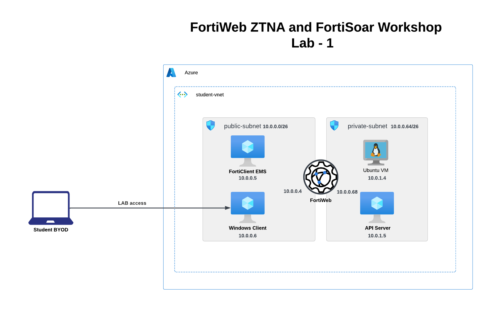
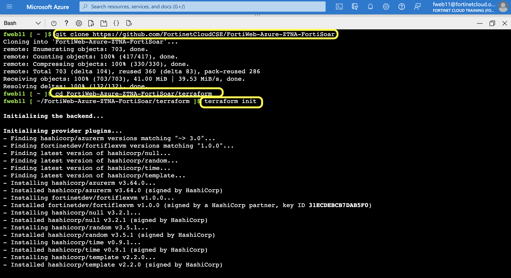
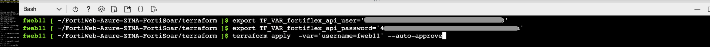
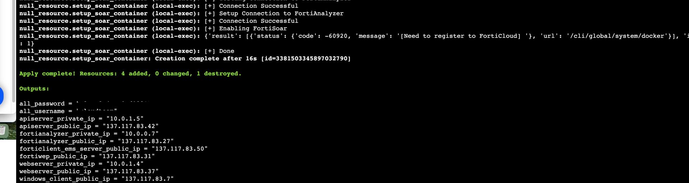

### Task 2 - Launch resources using Terraform

All the components required for Lab1 and Lab2 are deployed through terraform. 

Here is the Architecture diagram for Lab1: 



Perform the following steps in your Cloudshell console to create your environment.

1. Clone the Github repo `git clone https://github.com/FortinetCloudCSE/FortiWeb-Azure-ZTNA-FortiSoar`
2. Change directory to the `cd FortiWeb-Azure-ZTNA-FortiSoar/terraform` folder
3. Run `terraform init`

```sh
git clone https://github.com/FortinetCloudCSE/FortiWeb-Azure-ZTNA-FortiSoar
cd FortiWeb-Azure-ZTNA-FortiSoar/terraform
terraform init
```




4. Set the Terraform environment variables:
    1. `export TF_VAR_fortiflex_api_user='<api_user_sent_in_email>'`
    2. `export TF_VAR_fortiflex_api_password='<api_password_sent_in_email>'`
5. Run `terraform apply  -var='username=UserXX' --auto-approve`

    Your username can be found in the login email.  
    Say your Azure account login is fweb11@ftntxxxxx.onmicrosoft.com, your username is **fweb11** 

```sh
export TF_VAR_fortiflex_api_user='<api_user_sent_in_email>'
export TF_VAR_fortiflex_api_password='<api_password_sent_in_email>'
terraform apply  -var='username=UserXX' --auto-approve
```


    
6. Terraform deployment takes atleast 25-30 min to complete. Please copy the output once the deployment is succeeded. 




