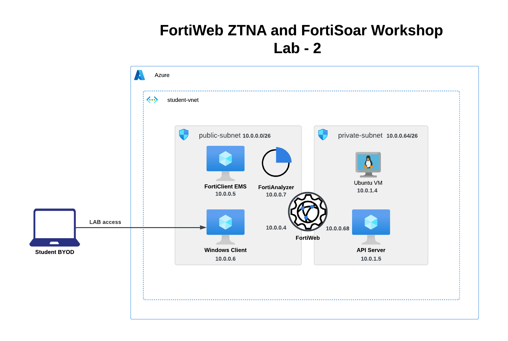

### Task 2 - Launch resources using Terraform

All the components required for Lab1 and Lab2 are deployed through terraform. 

Here is the Architecture diagram for Lab1: 

Lab2: 

Perform the following steps in your Cloudshell console to create your environment.

1. Clone the Github repo `git clone https://github.com/FortinetCloudCSE/FortiWeb-Azure-ZTNA-FortiSoar`
1. Change directory to the `FortiWeb-Azure-ZTNA-FortiSoar/terraform` folder
1. Run `terraform init`

