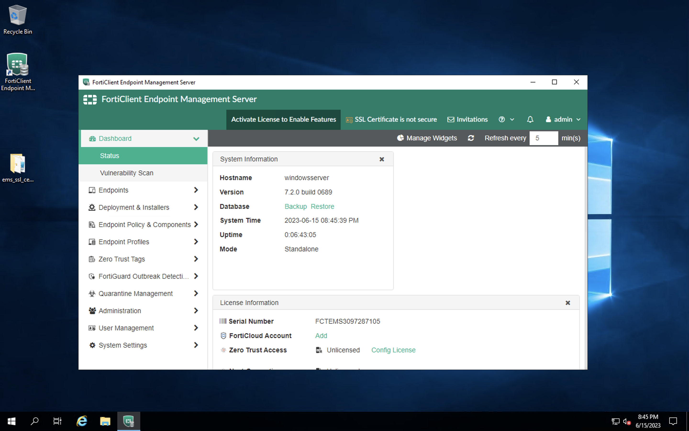

#### 1. **EMS Setup and licensing**

1. RDP to the Windows Server IP address using the all_username and all_password credentials.

    

2. FortiEMS is already installed on Windows Server. 

    

3. Double-Click to open FortiEMS. On the first login, username is admin/password is blank. Click Signin. 

    

4. We need to Set up new password here. Please note this password as we will use this to sign in to EMS. 

    

5. The FortiEMS is not licensed. We need to upload the BYOL license. License is already provided through email for the Cloud CSE    team. If license is not provided you can ITF the FortiEMS license with SKU: FC1-10-EMS04-429-01-12. 
    
    

6. To activate the license, copy the hardware ID from EMS System >> Dashoboard >> Status. 

    

7. Login to https://support.fortinet.com, register asset >>
    
    1. Paste the registration code from the license document, click Next
    2. Paste the Hardware ID from the EMS >> register

    

8. On EMS Dashboard >> Status - login with the FortiCloud Account the license is registered. 

    

#### 2. **Updating License**

1. On EMS, we see _"SSL Certificate is not Secure"_ at the top. 

    

2. To upload a certificate to EMS, Navigate to System Settings >> EMS Server Certifcates >> Add. on **Upload PKCS12** tab, browse to find certificate from the Dekstop. 

    

3. on the Desktop, there is a folder called ems_ssl_certificates >> upload EMS_Demo_Server certificate. **Password** for the certifiactae is _password_ (all lower case)

    

4. In System Settings >> EMS settings, for WebServer certificate select the newly uploaded certificate and also enable "use webserver cert for end point control" , click Save. 

    

5. On EMS >> In Endpoint Policy and components >> CA Certificates >> Upload the CA Certificate from the ems_ssl_certificates folder on the Desktop. 

    

6. Now you should see that the EMS Certificate is SSL secure at the top. 

    
