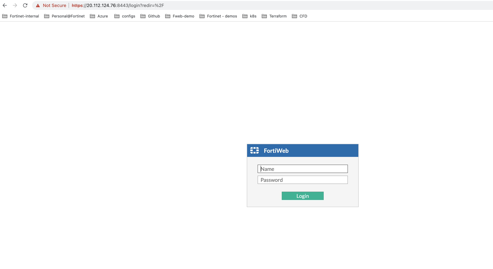
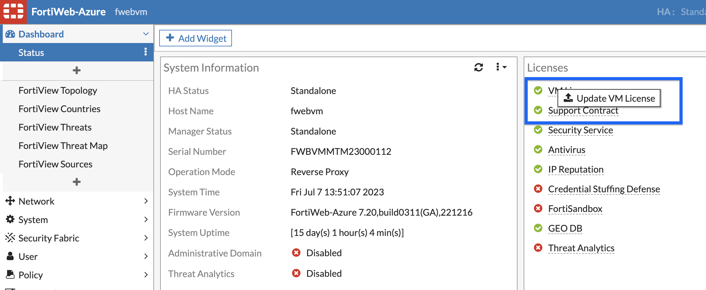
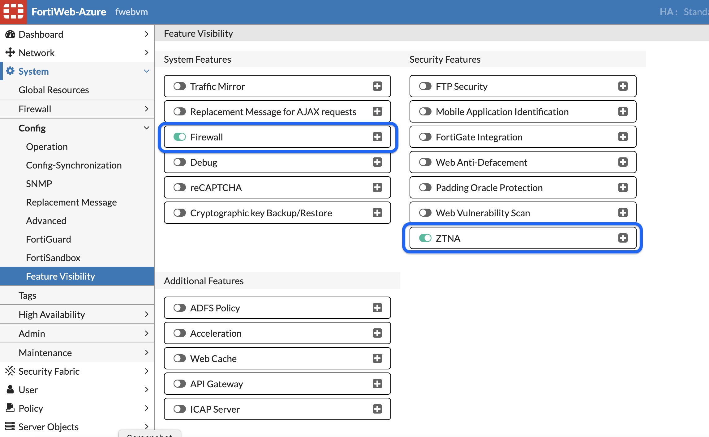

## Licensing FortiWeb

1. Login to FortiWeb with https://<fortiweb_pip>:8443. Fortiweb_pip IP can be found from Terraform output. Use the all_unsername and all_password as login credentials. 
 
 

2. For licensing FortiWeb, please check your email. License is already provided. After uploading the the FortiWeb will reboot. 

 

 Its a good idea to get some coffee while it is rebooting ;) 

3. After FortiWeb is back up, in System >> Config >> Feature visibility, enable ZTNA and Firewall features. 

 