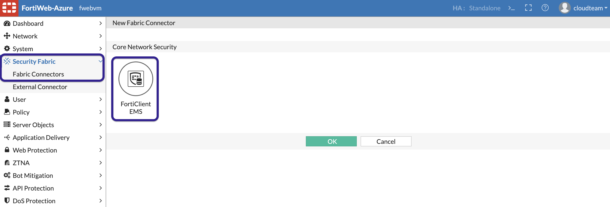

## Connect FortiWeb to EMS.

1. To connect FortiWeb to EMS, go to Security Fabric >> Fabric Connectors >> FortiClient EMS

    

2. Enter the IP and Port for FortiWeb to connect to FortiClient EMS, click OK.

    

3. You will see a Certificate warning to connect to EMS. Click OK.

    

4. Login to FortiClient EMS, in Administration >> Fabric Device >> Authorize the FortiWeb.

    

5. Once Authorized we should see that the connection is up on FortiWeb. 

    