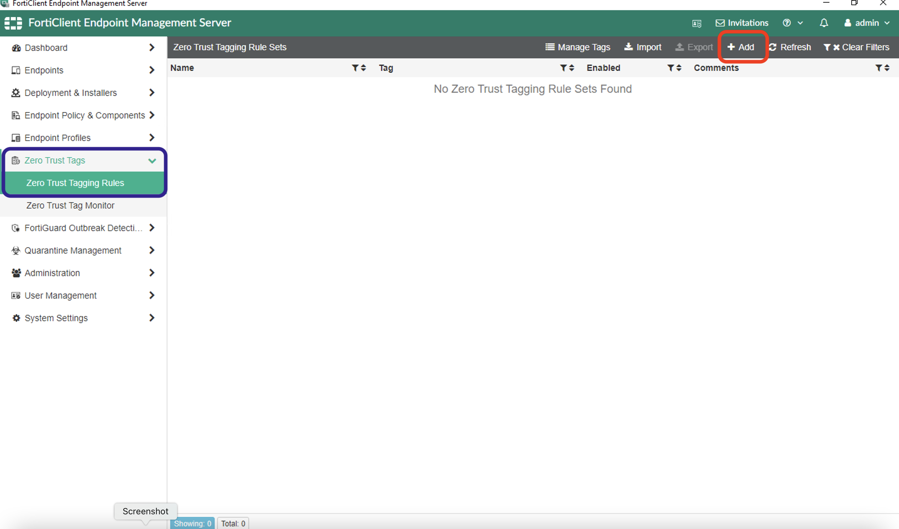
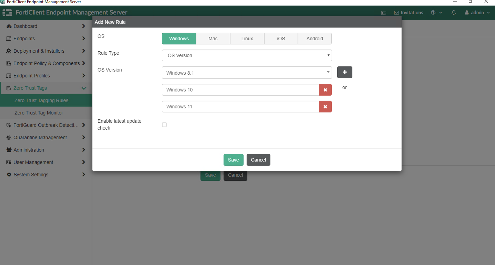
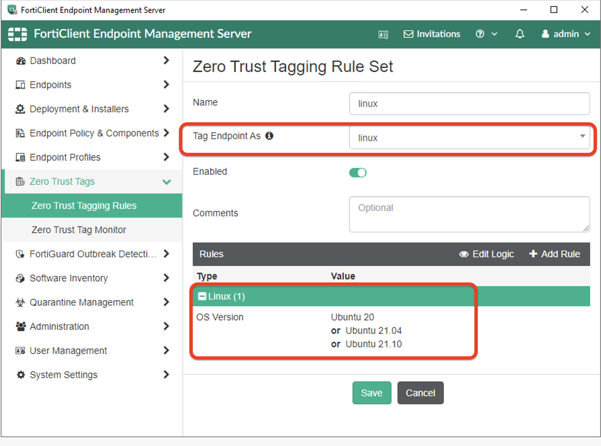
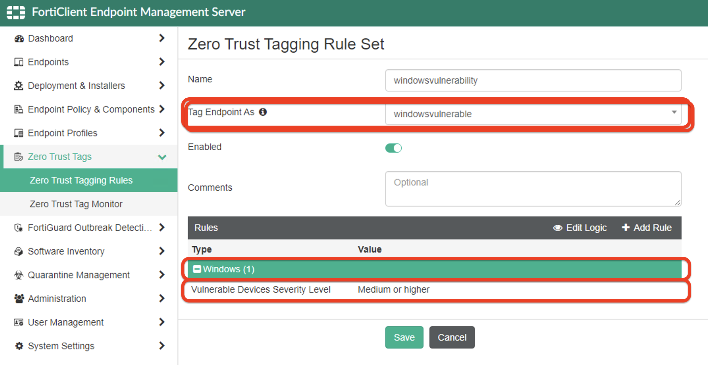
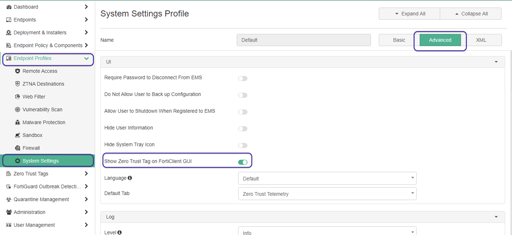

### **Creating ZTNA tags on FortiEMS**

We need to create ZTNA tags to tag endpoints that connect to FortiClient. These tags will sync with FortiWeb and can be used in ZTNA rules. 

1. To create tags, on FortiClient EMS navigate to Zero Trust Tags >> Zero Trust Tagging rule >> Add. 

    

2. Enter **name**: windowsclient, **tag endpoint as**: windows (_Press Enter for creating a new tag_), click **Add rule**

    

3. In the rule, Select **Windows**, in OS type: **Windows**, add the Windows version as shown below. 

    

4. Repeat Same steps for Linux. 

    

5. Also Create another tag for windows vulnerbale device as show below. 

     

6. By default we cannot see ZTNA tags when Endpoints connect to Zero Trust telemetry. For ZTNA tags to be visible on FortiClient, you need to enable in FortiEMS. 

On FortiEMS >> Endpoint profiles >> System Settings >> Advanced >> enable show zero trust tag on FortiClient GUI.
    