## FortiWeb Policy setup

1. Before creating ZTNA profiles and Tags, We need to create a Server policy on FortiWeb. To create a server policy set up a server pool on FortiWeb. 

    In Server Objects >> Server Pool >> Create new >> Enter as shown below >> Click OK

    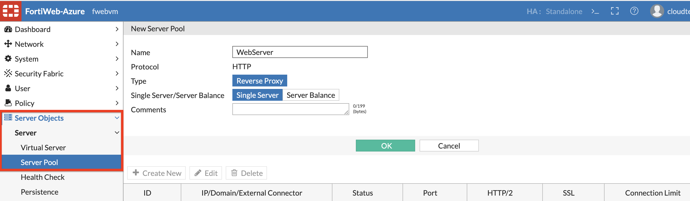 

2. Click Create New to create a new server in Server pool as below.

    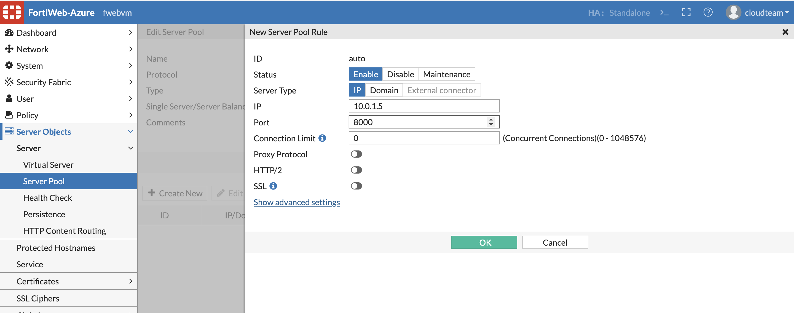 
    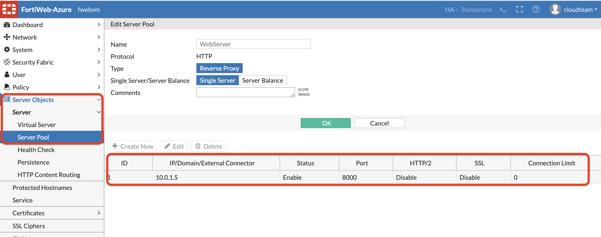 

3. Now, Create a Virtual Server. Server Objects >> Virtual Server >> Create new >> click OK

    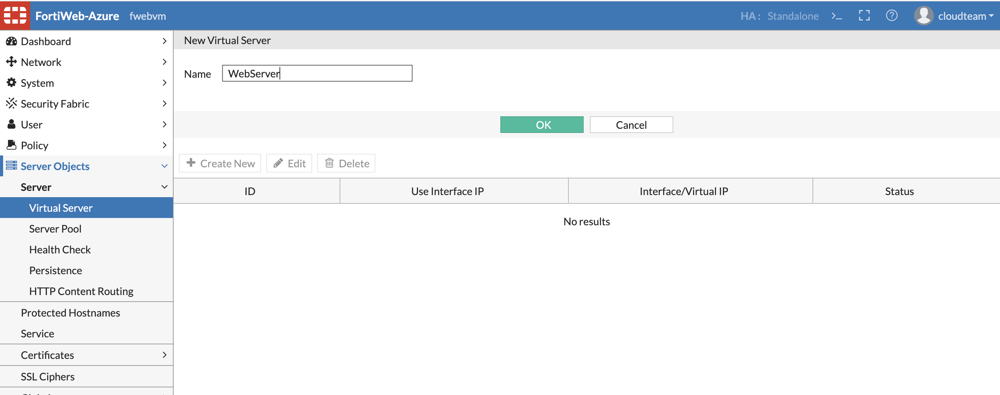 

Now we will create a Virtual Server to listen on Port1 IP address
     
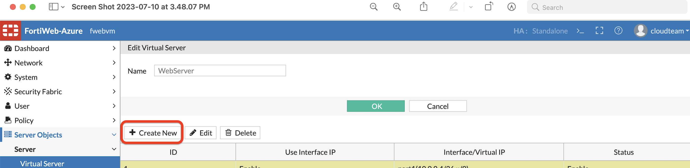 

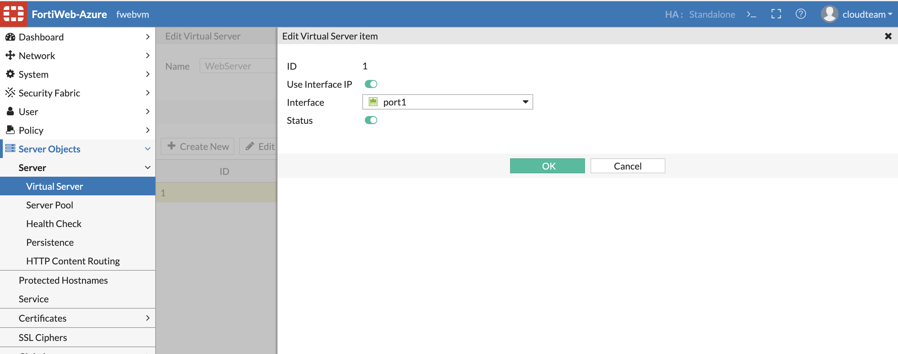 

4. Create a certificate in Server Objects >> Certificates >> CA Group

     

5. Create New CA group for FCTEMS and click OK. 

    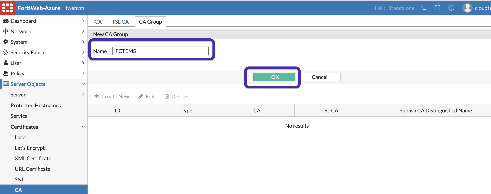 

6. Select Type CA, Select CA for FCTEMSXXXXXXX certificate as the CA, Click OK.

        

        

4. Create a Server policy , in Policy >> Server Policy >> Create New as shown below. 

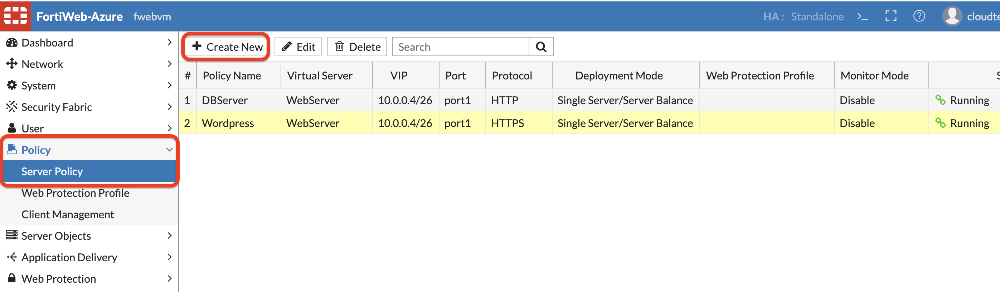 

5. For Server pool, Virtual Server select the objects you created in Step 2 and 3. For HTTPS service select HTTPS

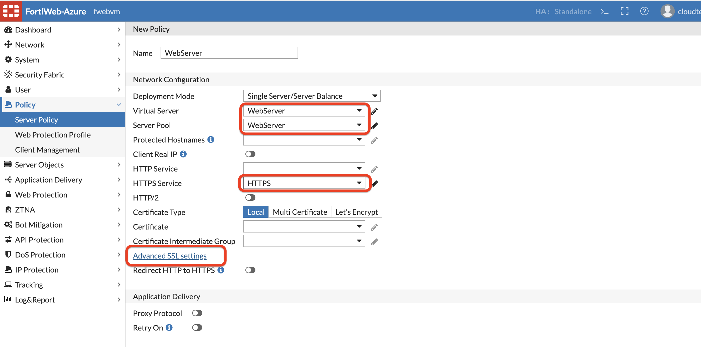 

6. Click **Advanced SSL settings**, For _Certification verification for HTTPS_ click create new: 

     

7. In the New Certificate Verify Tab, select the CA you have created earlier in Step 6. Finally Clik OK on the server policy. 

     

# ZTNA Policies on FortiWeb. 

8. Before setting up FortiWeb ZTNA rules, check if the ZTNA tags synced from FortiClient EMS to FortiWeb. On FortiWeb navigate to ZTNA >> ZTNA profile >> ZTNA tags. FortiWeb Might have to scroll to the end to see the tags created in earlier step. 

    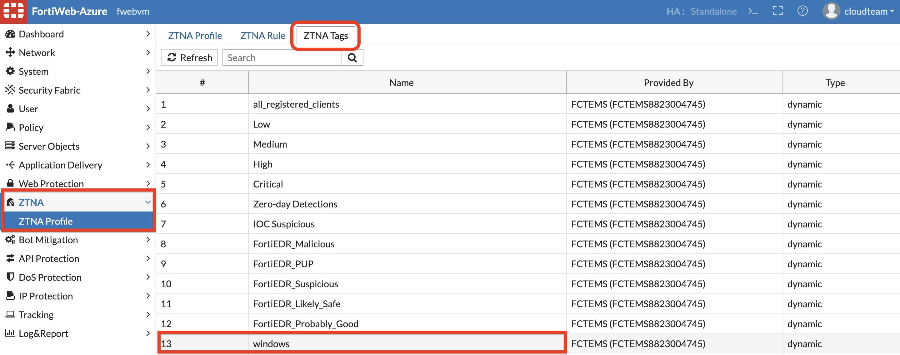 

9. Create ZTNA rules to access the FortiWeb Web Server. 

     

Click on **Add Condition**

10. Select Type: ZTNA Tag, from Tag list Windows, Match condition: Any, click OK.
 
 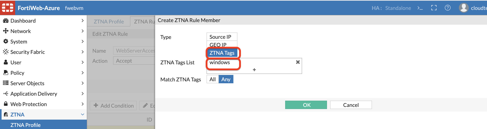 

11. In ZTNA profile, Create ZTNA profile with name WebServerAccess, Set Default action to Alert and Deny. 
 
    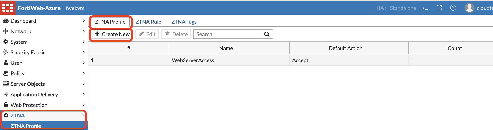 

12. For ZTNA rule >> Create new >> Add the rule you added in Step 9. 

    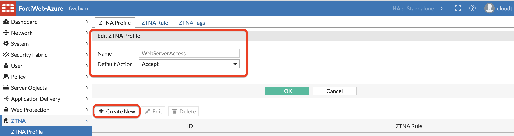 

    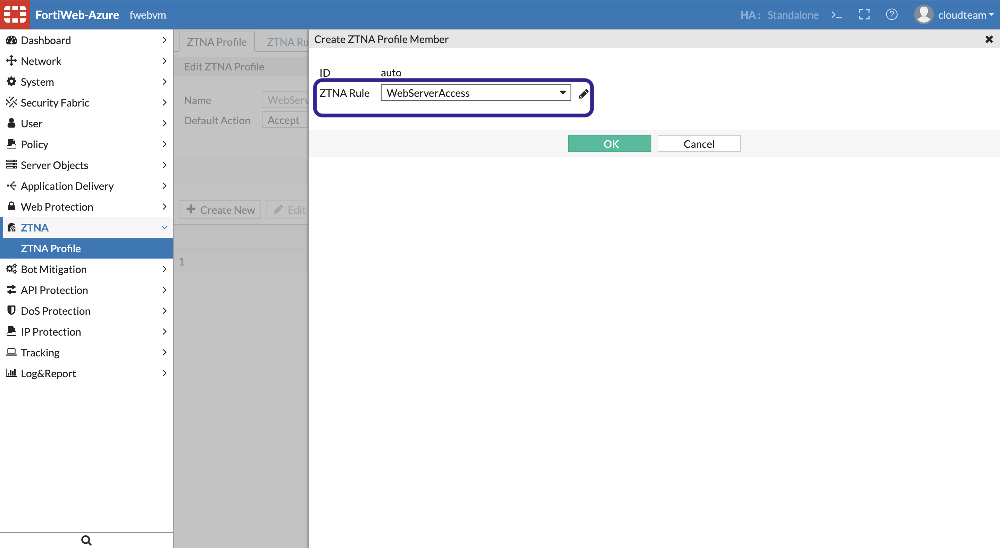 

13. Now go back to Server Policy >> Policy >> Edit the existing Policy. 
    Scroll down to ZTNA profile and assign the profile created in previous step and click Save. 

    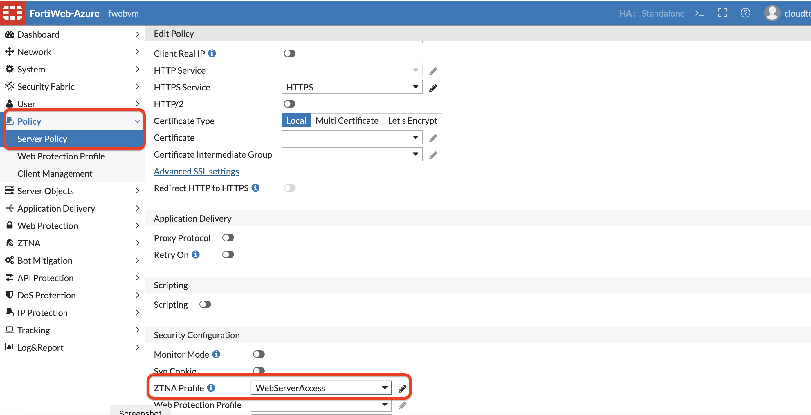 