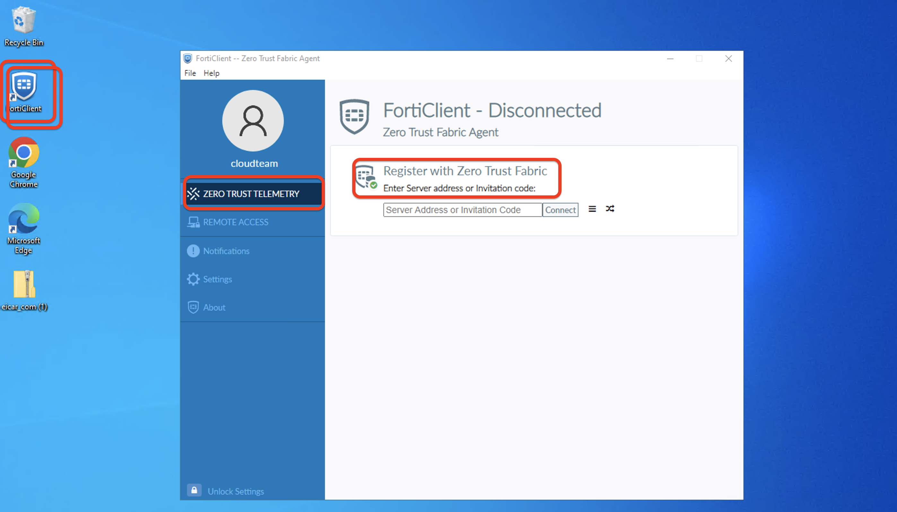
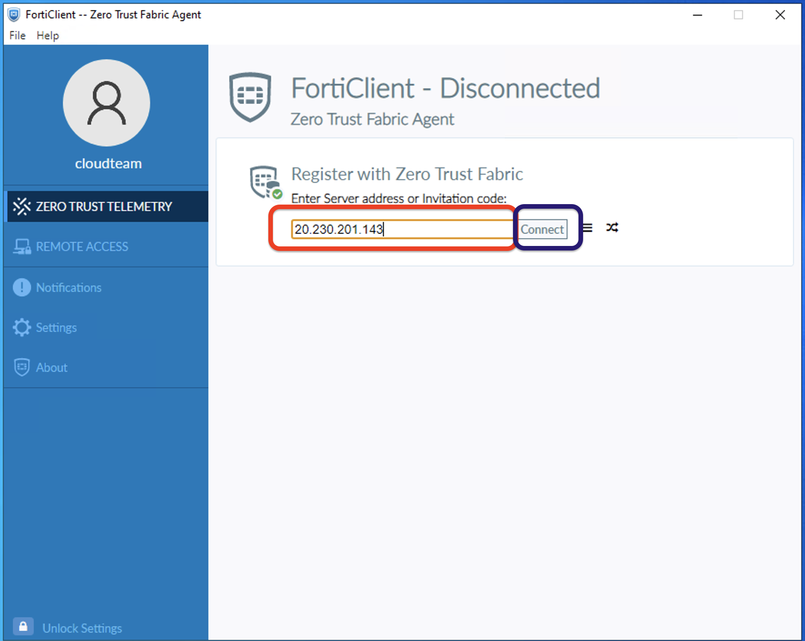
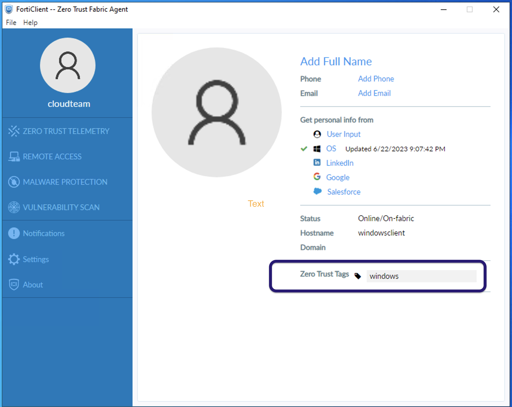
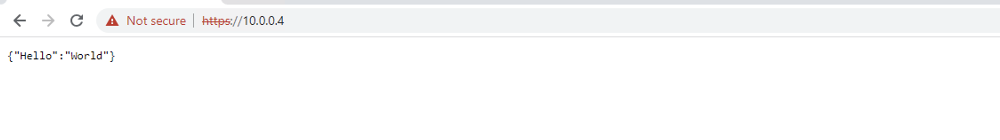
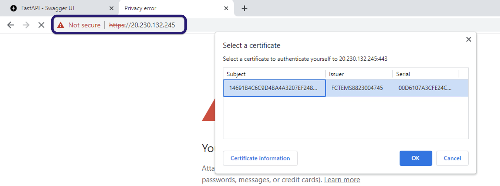
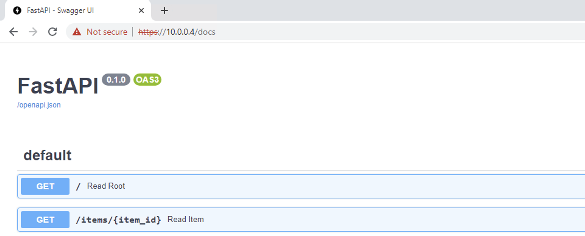
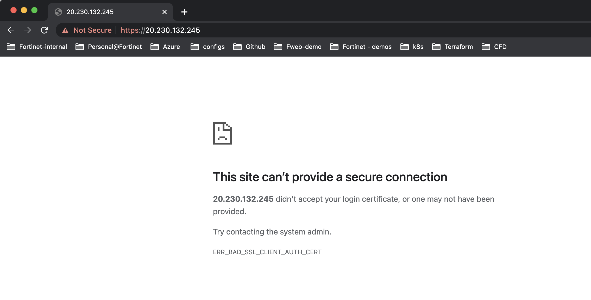

## Test ZTNA North-South Inspection

1. To Test N-S Access, RDP to Windows10 Client (IP address is on Terraform Output)

2. on Windows 10 VM, the FortiClient is already installed. Double click on FortiClient EMS, Click on Zero trust telemetry

     

3. In Zero Trust Telemtry >> Input the IP of your Windows >> Click Connect

     

4. Once the FCT is connected to EMS, you should see a Windows Tag assigned to FCT.

     

5. Open a browser on Windows Cliet and type https://10.0.0.4 in the browser or the Public IP address of FortiWeb the Port1 is NAT'd. Remember 10.0.0.4 is the Port1 IP of FortiWeb we created a Virtual Server. 

   
 
   

6. You can also check to get to the API documentation by typing https://10.0.0.4/docs

  

7. Repeat the same step from your local machine. You should not be able to get to the FastAPI web page since you are not conencted to FCTEMS.

  

