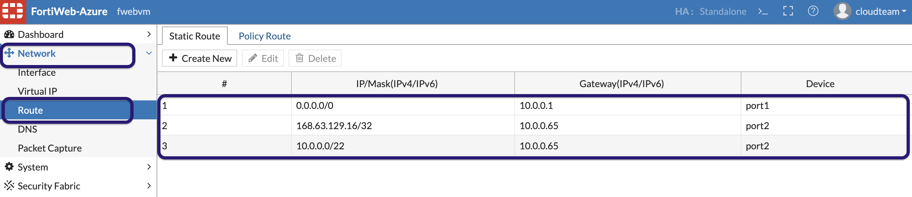
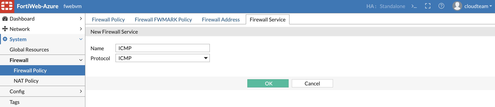
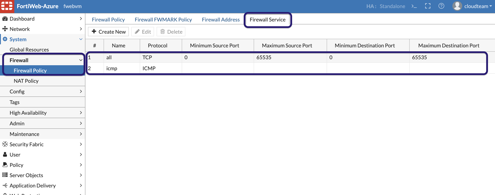
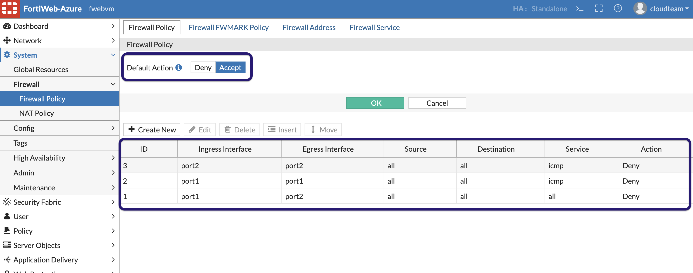
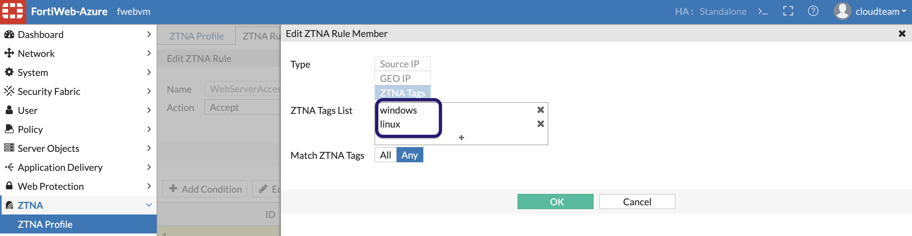
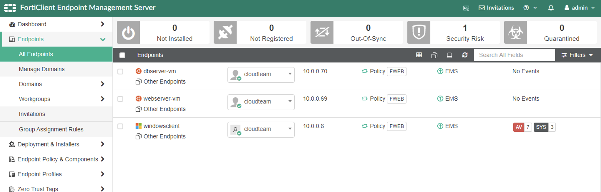
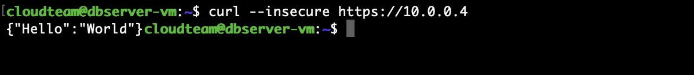
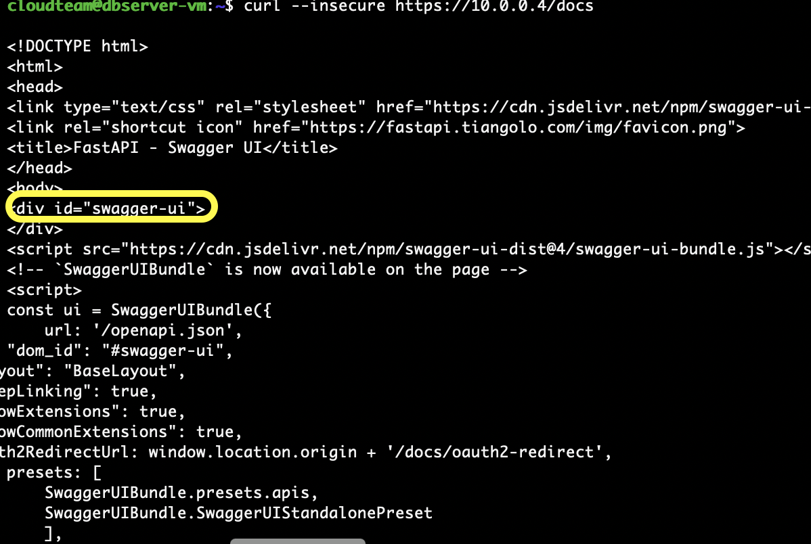

## East-West inspection

1. Now that Server policy is all setup, for microsegmentation within trusted network using ZTNA we need to edit the ZTNA profile. Also, since FortiWeb has a firewall we will be using a firewall policy to prevent traffic between trusted network.

2. lets create a static route to get to the internal VNET through port2 in Network >> Route >> Static route.

   

3. Also Lets create a firewall policy. In System >> Firewall >> Firewall Policy >> Firewall Service. 
    1. Create a Service for ICMP 
         

    2. Create another service all, by leaving everything to default. 
        

4. To create a firewall policy , set the default action to **"Accept"** also create policies as shown below to deny the icmp traffic and also all Port1 to port2 traffic. 

    

5. Now in ZTNA profile, update the already created ZTNA rule to add Linux tag. 
    
     

6. Linux VM is already connected to the EMS. You can check endpoints connected to EMS. 

     

7. Now SSH to the other trusted Linux VM (IP address is in Terraform output) to get to the API server. once logged in type the below command.

    curl --insecure https://10.0.0.4  
    curl --insecure https://10.0.0.4/docs 

You should see hello world response from the first command and also swagger html as a response from the /docs 

8. Now try the same to hit the trusted server directly. 

    curl --insecure https://10.0.1.4  
    curl --insecure https://10.0.1.4/docs 

