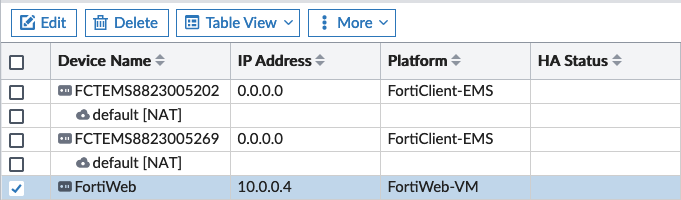
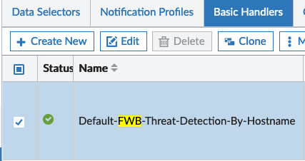

# Prepare FortiAnalyzer and FortiWeb for the Lab

This Chapter includes necessary steps to setup Log shipping and Event Monitoring with FortiAnalyzer of FortiWeb. Please make sure you have completed this section before moving on!

## FortiWeb Preparations

1. Login to FortiWeb with the give credentials


2. On the left sided menu, goto `Log&Report` - `Log Policy` - `FortiAnalyzer Policy`


3. Select `Create New` at the top left to open the Configuration Wizard


4. Provide a meaningful name for the Policy and the click `OK` to save


5. After the Policy has been saved, click on `Create New` to a add a new entry to the policy
6. Enter the IP Address of Fortianalyzer into the corresponding field, then click on `OK` to add the entry


7. Check that the new entry was added successfully, click `OK` again to make sure that everything is saved.


8. On the left sided menu, goto `Log&Report` - `Log Config` - `Global Log Settings`


9. Enable FortiAnalyzer and select the previous configured FortiAnalyzer Policy


10. Click on `Apply` at the bottom of the Page to save the configuration.

11. To enable the global logging, open the built-in CLI by clicking on the `>_` Symbol the to top right


12. Execute the following commands

```shell
config log traffic-log
set status enable
end
```

13. Logging of FortiWeb to FortiAnalyzer is now enabled. Please proceed with the configuration of FortiAnalyzer

## FortiAnalyzer Preparations

1. Login to FortiAnalyzer with the given Credentials


2. Goto `Device Manager` and click on `Add Device` to add FortiWeb


3. Provide the follwoing Information, then click on `Next` to proceed with the configuration.

   - Name: `FortiWeb`
   - Serial Number: <Serial Number of FortiWeb> (This can be found at the Dashboard of FortiWeb)

   

   

   4. Wait until the Device got added successfully. Then click on `Finish` to close the wizard.

   

   5. To finalize the FortiWeb configuration, select the entry from the Device table and click on `Edit`

   

   6. Update `Admin User` and `Password` with the given credentials, then click on `OK` to save.

   

   

   

   7. To be able to feed Security Events within FortiSOAR, Events need to get generated within the Event Monitor. For this to work, a so called Handler needs to be in Place. The Handler for FortiWeb is disabled by default and needs to be enabled. For this, goto `Incidents & Events` - `Handlers`

   

   8. Select the `Basic Handlers` Tab, then use the Search field at the top right to search for `FWB`

   

   9. Right click on the search result, click on `Enable` to activate the handler.

    

   10. Check that the Status changes from `disabled` to `enabled` (green checkmark)

   #

   11. As soon as FortiWeb detects an attack, a new Event entry will get added. See the following Example:

   

   Please make sure, that a `Web Protection Profile` is used within the configured FortiWeb Policy. The default policies provided by FortiWeb are more than enough with regards to this lab.

   

12. Congratulations, you are done with the preparations. Please continue to the next Section of the Lab.