## How to Connect to FortiSOAR Webinterface

1. Open the URL of FortiAnalyzer, using the Public IP Address (e.g. https://20.234.157.6)
2. Login into FortiAnalyzer with the provided lab credentials

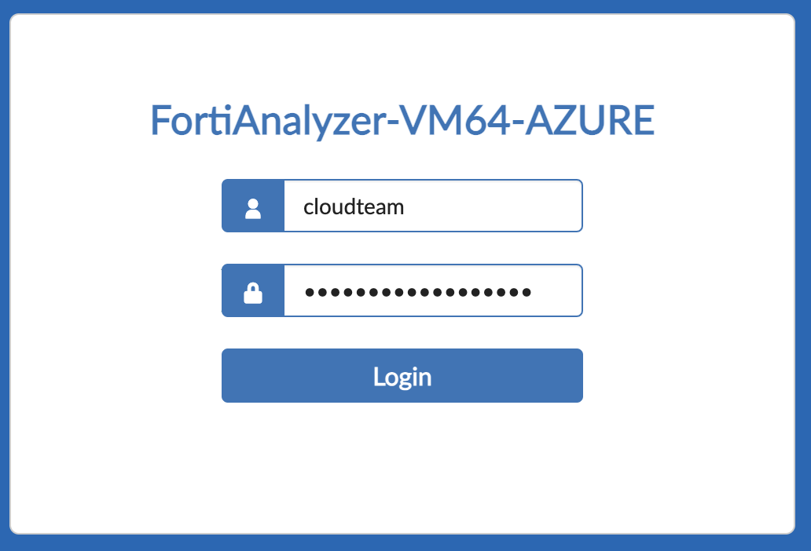

3. In the FortiAnalyzer Setup Wizard, click on `Next`, then keep the default hostname and click on `Next`again.

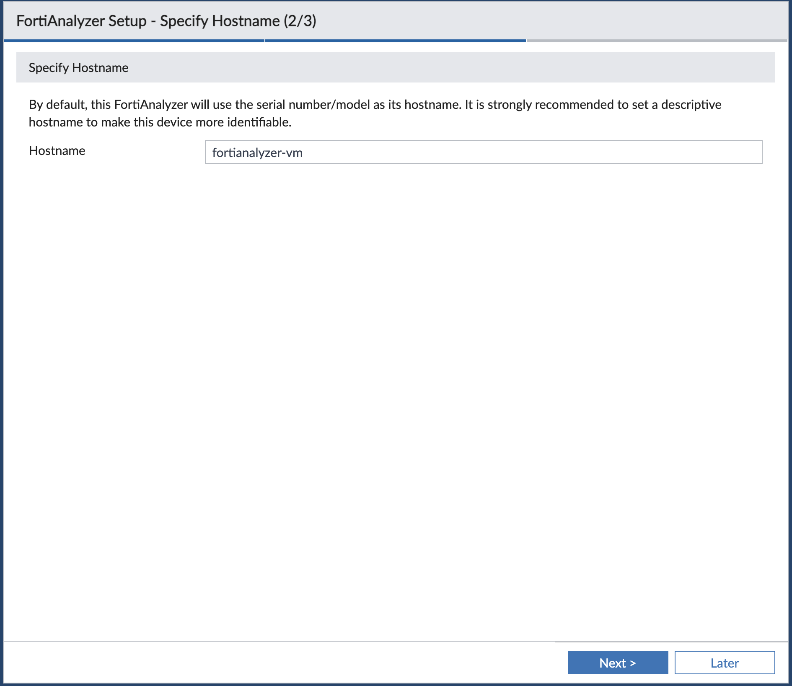

4. Click on `Finish` to complete the Setup

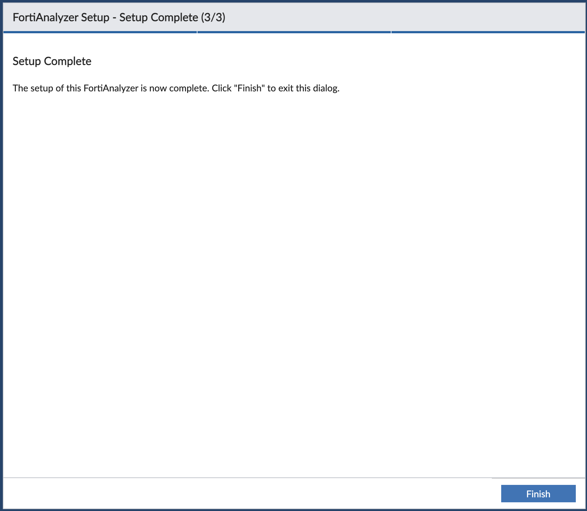

5. At the left side menu, select `Management Extension`

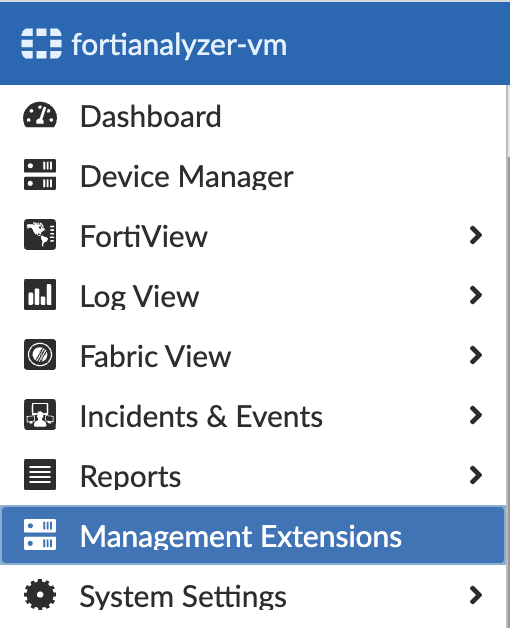

6. if not automatically selected, click on `FortiSOAR` to access the FortiSOAR Webinterface. In Case not already done, accept the Terms and Service by Scrolling down to the Bottom of the embedded Site and click on `Accept`

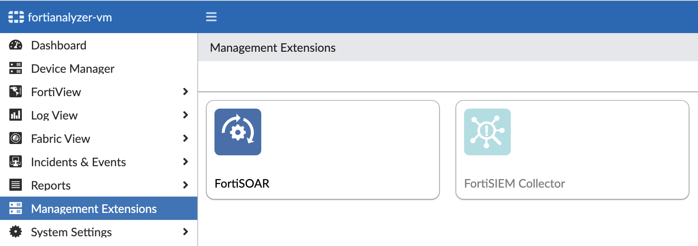

6. The FortiSOAR Dashboard Page should be now visible as a iframe

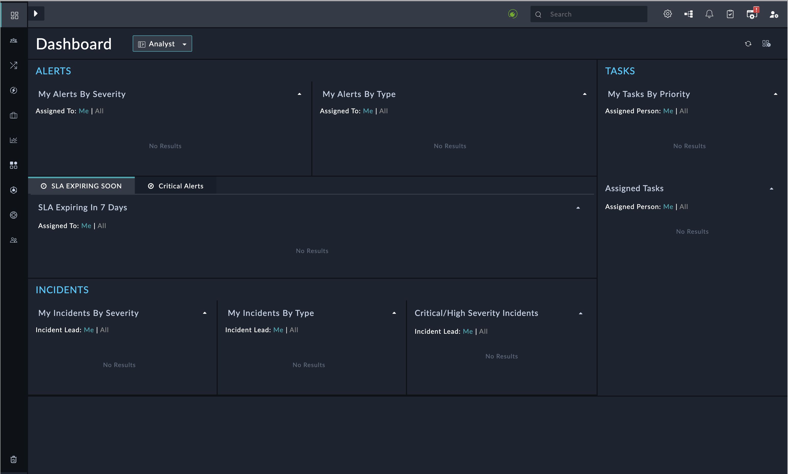

8. Congratulations, you have successfully logged into FortiSOAR. Proceed with the next Chapter.

## Install Licenses into FortiSOAR

By default, FortiSOAR comes with a limited Perpetual license. This type of license provides you with a free trial license an unlimited time for FortiSOAR, but in a limited context, i.e., with restrictions on the number of users and actions that can be performed in FortiSOAR in a day. By default, this license is an "Enterprise" type license and is restricted to 2 users using FortiSOAR for a maximum of 300 actions a day.

1. Within the FortiSOAR WebUI, select the Gear icon at the top right.

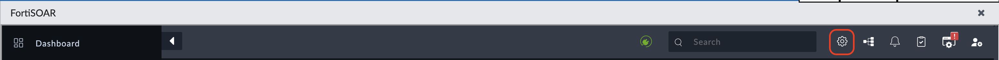

2. In the System Configuration, goto the License manager

3. Copy the Device UUID and enter into the [Support Portal](https://support.fortinet.com) to be able to Download the licenses file.

3. Upload the license file via `Update License`
4. Drag'n Drop / Select the license file, then click on `Install License File`

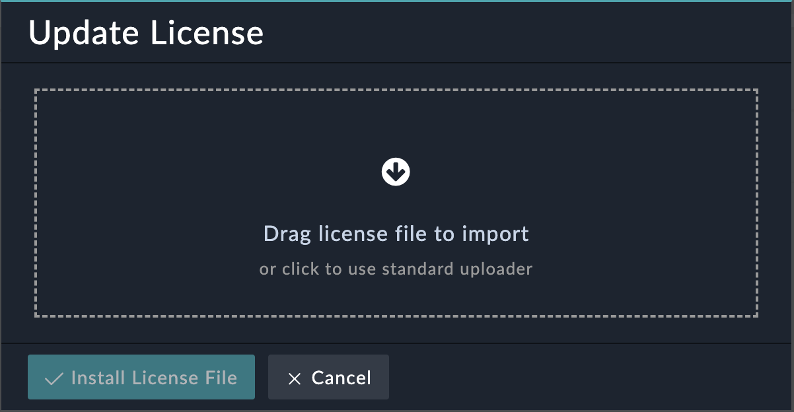

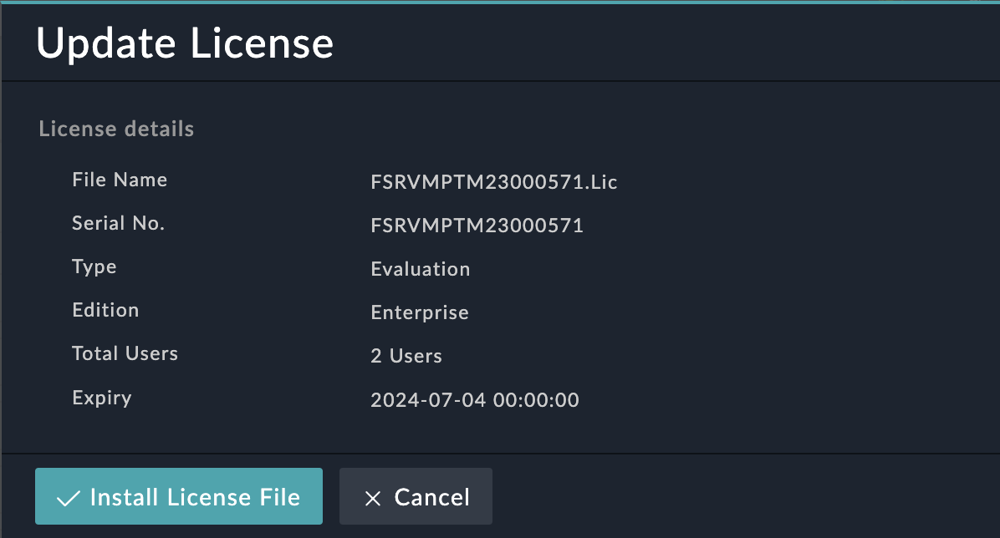

6. `Confirm` the Installation of the new license

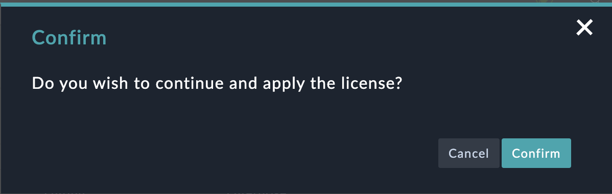

If you recive an error like below, wait some minutes and repeat the step

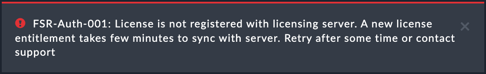

7. Validate that the new license has been installed correctly

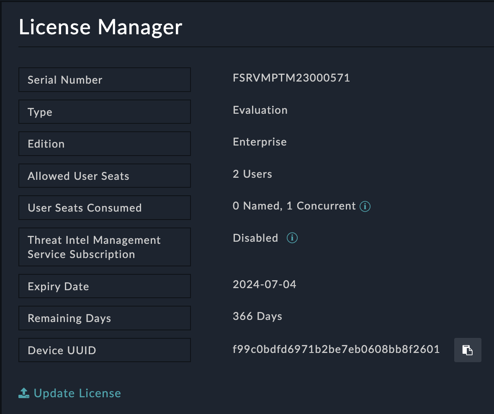

## Incident and Alarm Handling in FortiSOAR

Incident and alarm handling are crucial components of any security operation. When security incidents occur or alarms are triggered, it is essential to have a systematic and efficient approach to address them. FortiSOAR provides a centralized platform to manage and handle incidents and alarms effectively.

With FortiSOAR, security incidents and alarms from different security devices and systems, such as FortiWeb and FortiClient EMS, can be consolidated and correlated in a single dashboard. This consolidation allows security teams to gain a comprehensive view of the security landscape, enabling faster and more accurate incident response.

FortiSOAR automates the initial triage and categorization of incidents and alarms, reducing the manual effort required. It applies predefined playbooks or workflows to incidents based on their severity, type, or other criteria. Playbooks consist of a series of automated actions, such as gathering additional information, enrichment, containment, and remediation. By automating these repetitive and time-consuming tasks, FortiSOAR enables security teams to focus on more critical and strategic activities.

More Information can be found in the [FortiSOAR User Guide - Working with Modules - Alerts & Incidents](http://docs.fortinet.com/document/fortisoar/7.4.1/user-guide/207087/working-with-modules-alerts-incidents)

## How to access the Alarms & Incident section

1. Expand the sidebar menu by clicking on the arrow the at top left

2. Select `Incident Response` - `Alerts` to access the recived alerts and events

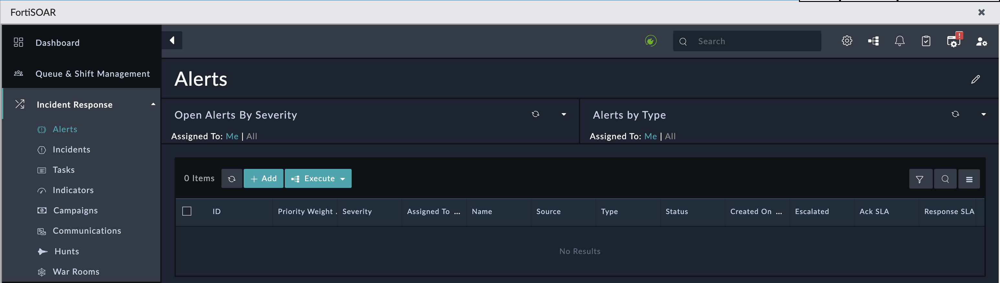

This Section is empty at the moment. The further we get in the lab, the more alerts there will show up.

3. The `Incidents` can be found in the same menu right after the `Alerts`

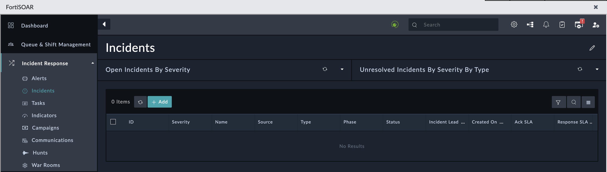

Incidents are usually a group of multiple events and can contain multiple Alerts and Indicators. 