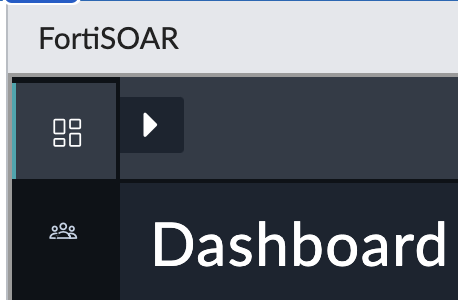

## FortiSOAR Content Hub & Connectors

Content Hub is a vital component of FortiSOAR that provides a centralized repository of pre-built playbooks, scripts, and integrations. It serves as a knowledge base and resource center for security operations, allowing teams to leverage existing content and collaborate effectively.

Content Hub offers a vast collection of pre-defined playbooks created by Fortinet's experts and the broader cybersecurity community. These playbooks cover a wide range of use cases, including incident response, threat hunting, vulnerability management, and compliance. By utilizing these pre-built playbooks, security teams can accelerate their response times and ensure consistency in their incident handling processes.

In addition to playbooks, Content Hub provides access to a variety of integration connectors. These connectors allow FortiSOAR to connect and interact with different security tools, such as FortiWeb and FortiClient EMS, as well as third-party solutions. This seamless integration capability ensures that incidents and alarms from various sources can be ingested, analyzed, and responded to from a single platform.

Furthermore, Content Hub enables collaboration and knowledge sharing among security professionals. It allows users to contribute their playbooks, scripts, and integrations to the community, fostering a vibrant ecosystem of security automation. This collaborative approach encourages the exchange of best practices and empowers security teams to continually improve their incident response capabilities.

More Information can be found in the [FortiSOAR User Guide - Content Hub](http://docs.fortinet.com/document/fortisoar/7.4.1/user-guide/667127/content-hub)

### How to access the Content Hub

1. If not already done, expand the sidebar menu by clicking on the arrow the at top left

2. Select `Content Hub`  to access the recived alerts and events

3. A whole new view gets populated. This allows to search and filter for various Connectors, Solution Packs and Widgets to advance FortiSOAR

The same information can be also found at the [FortiSOAR Content Hub Webpage](https://fortisoar.contenthub.fortinet.com/)

### Install FortiAnalyzer Connector

1. Search for FortiAnalyzer in the Searchbar

2. Selec the `Fortinet FortiAnalyzer` Connector. A new overlay Window appear which provides more details and the ability to install the connector.

3. To Install the selected Connector, click on `Install` at the bottom left of the Popup.

4. To start the Installation, click on `Confirm`

5. Wait until the Connector Installation has been completed

6. After the successfull Installation, it will automatically return back to the Connector Popup which provides now additional configuration fields

 

7. Add a new configuration with the information show on the screenshot. Adjust the values to fit the information provided for the lab.

8. Click on `Save` and validate that all Steps of the configuration verification, including the Health check are successfull.

9. Close the Configuration Popup. 

10. The Installed Connector can be viewed in at the `Manage` Tab

### Setup FortiAnalyzer Data Ingestion

Connectors in FortiSOAR can be used to tak action or to ingest Data into FortiSOAR like Assets, Events or Indicators, etc. Some Connectors, for example the FortiAnalyzer Connector allow to Ingest Data & take actions like `Run Report`, `LIST LOG FIELDS`, etc. These actions can be used within a playbook to "do something". We will have a closer Look into Playbooks and how Connectors can be used in the next Chapter.

- To view the predefined actions of a Connector, select the `Actions & Playbooks` Tab after you have selected a Connector

To Configure the Data Ingestion of FortiAnalyzer, for example to feed Events generated by FortiClient EMS into FortiSOAR, take the following steps:

1. In the FortiSOAR menu sidebar, goto `Content Hub`, select the `Manage`Tab

2. In the Searchbar type `FortiAnalyzer`

3. Select the FortiAnalyzer Connector, and click on `Configure Data Ingestion` at the right side of the Window

4. A new Overlay Popup will appear. Click on `Let's start by fetching some data` to start the configuration process

5. To configure field mappings with example data, adjust the default value as shown below and continue by clicking on `FETCH DATA` at the bottom right corner

6. keep the default field mappings and continue with the configuration by clicking on the button at the bottom right corner

7. In this lab, we will manually trigger the ingestion as the Lab is using an unlicensed version of FortiSOAR. This is limited to 300 Actions per day which also includes Data ingestion. In an production environment, a Schedule would be configured to automtically ingest the data and add the alerts to FortiSOAR.

8. Finish the configuration of the Data Ingestion by clicking on the `Save Settings & Continue` at the bottom right corner.

9. Click at `OK` at the bottom right of the screen to close the PopUp.
10. Close the Connector configuration Wizard PopUp.
11. To Manually ingest the Events, goto `Automation` - `Data Ingestion` at the left side Menu

12. An overview of all availibe Connectors wich allow Data Ingestion will appear.

13. By selecting the `Fortinet FortiAnalyzer` entry, an overview of the availible configurations will appear. Select `Trigger Ingestion Now` at the right to feed in availibe events and alerts.

14. A banner at the top of the page will appear which confirms that the ingestion is running. 
15. To view the results, switch to the `Incident Response` - `Alert` Section and view the events getting added to FortiSOAR.

### Install FortiClient EMS Connector

1. In the `Content Hub` menu, go back to the `Discover Tab` and search for `FortiClient EMS`

2. Select the Connector and install if not already done.
3. Setup a new Configuration as shown below. Adjust the values to fit the information provided for the lab.

4. Click on `Save` and validate that all Steps of the configuration verification, including the Health check are successfull. 

