## Create your own Playbook

### Playbook Editor

To start with the creation of a new Playbook, take the following Steps:

1. Goto `Automation` - `Playbooks`

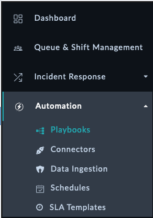

2. Choose any Collection you want (for example `01 - Drafts` Collection), then click on `+ Add Playbook`

3. Provide a new `Name` for the Playbook, keep the default values and then click on `Create`

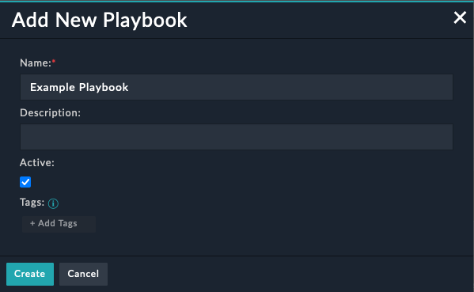

4. The Playbook Editor is now open and ready to use.

Every Playbook has to start with the `Trigger Step` This could be e.g. `Manual` if you do not want to have it executed automatically or if e.g. the Playbook should get executed when a new Alert is created, choose the `On Create` Trigger.

For more information about the Trigger Step, please have a look at the [FortiSOAR Playbook Development Guide](https://docs.fortinet.com/document/fortisoar/7.4.1/playbooks-guide/784146/triggers-steps#Triggers_&_Steps)

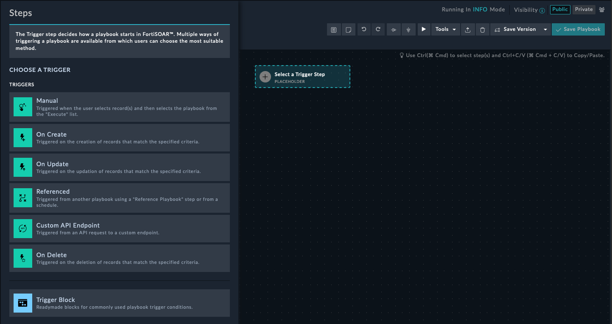

After selecting a Trigger, the `Name` and `Execution Behaviour` (Scope) needs to be defined. For Example, if the Playbook is used to reaction on an Alert, The `Alerts` Module would be selected. Multiple selections are possible if the Playbooks can be also used for other Modules.

In my case, I do not require any input to run, but the playbook should only be used in the Alerts Module.

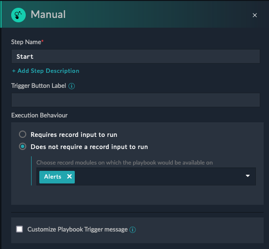

If done with the configuration of the Step, select Save at the bottom left of the Pop-up.

Now we have added our first Playbook Step - Good Job!

Before we will execute our Playbook to validate the functionality, change the `Mode` to `DEBUG`. This is important, as by default the INFO Mode only provides us if the Playbook run was successfull or not. This is to save space within the database and not filling it up with unneccessary details at runtime. While Development, we want to see which Variable and Step has which Output or Values assigned to make it easier in case of troubleshooting.

Within the Playbook Editor, click on `INFO` at the top right corner

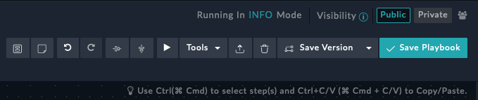

Select `DEBUG` from the dropdown menu and click on `Apply`

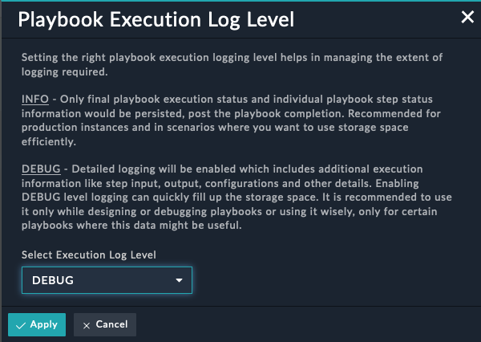

To Execute a Playbook, click on the "Play"-Button the the top right of the Playbook Editor.

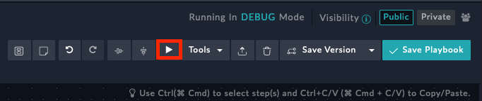

Don't forget to regularly press `Save Playbook` button to not loose your work. This is also required, before executing a Playbook.

Let's continue adding some Steps to our Playbook in the next Section.

### Playbook Steps

To add a new Step, just "drag and drop any highlighted connecot points to add a new Step".

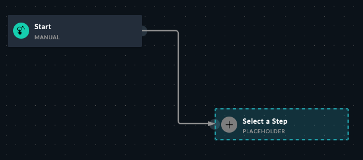

At the left side, a new Pop-up appears which allows you to choose the type of the new Step.

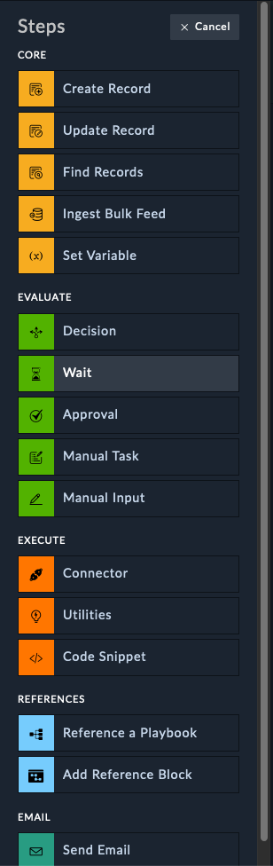

Depending on what you want to do/achieve, select the Step. To specify a Variabl use the `Set Variable` Step from the Core Steps. If you want to trigger an action e.g. within FortiClient EMS or use any availabile activity from our FortiSOAR COnnectors, use the `Connector` Step from the Execute Section, and so on. Find more details about the different Steps and capabilities within the  [FortiSOAR Playbook Development Guide](https://docs.fortinet.com/document/fortisoar/7.4.1/playbooks-guide/784146/triggers-steps#Playbook_Steps_..6)

I will first set a Variable as a next step. After selecting the Step `Set Variable` I have to choose a **Name** and then specify the variable name and it's Content. As a Value, FortiSOAR allows to use Jinja2 Expressions and Filters.

To see some examples, select the `Functions` or `Input/Output` Tab after you have clicked into the `Value` field

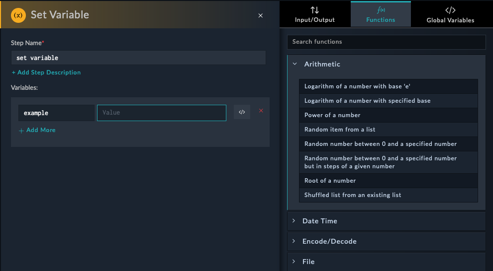

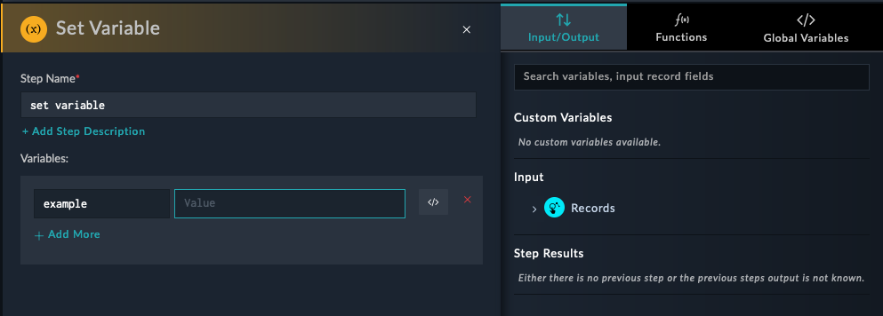

In my case I do not have any value I want to reference to, so I will just add a String as value.

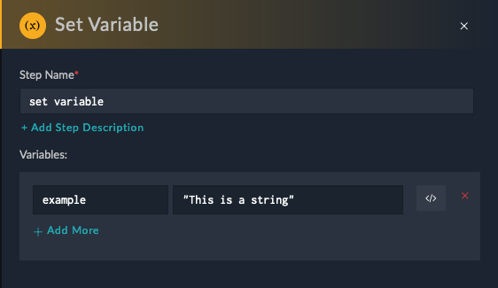

`Save` the step by clicking on the button at the bottom left.

Lets add another `Set Variable`Step which will access the previous added variable. For this, we need to provide a **Name** for the Step and a `Name` for the variable.

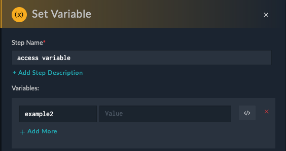

After clicking into the `Value` field, you will notive that the previous Variable appears on the right under the `Input/Output`Tab

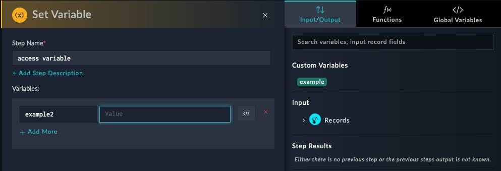

By selecting the Custom Variable `example` the Jinja2 Expression will be automatically added as Value.

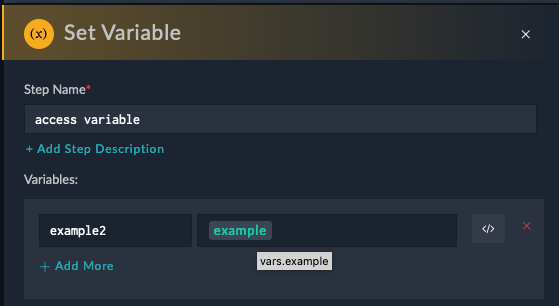

As an alternative, you can also write `{{ vars. example }}`

In case the next Step within a Playbook requires to use Values from a previous Step, FortiSOAR offers a very easy solution to access those. Just select the correlating Step within the Pop-up menu and follow the tree structur to select the required variable name.

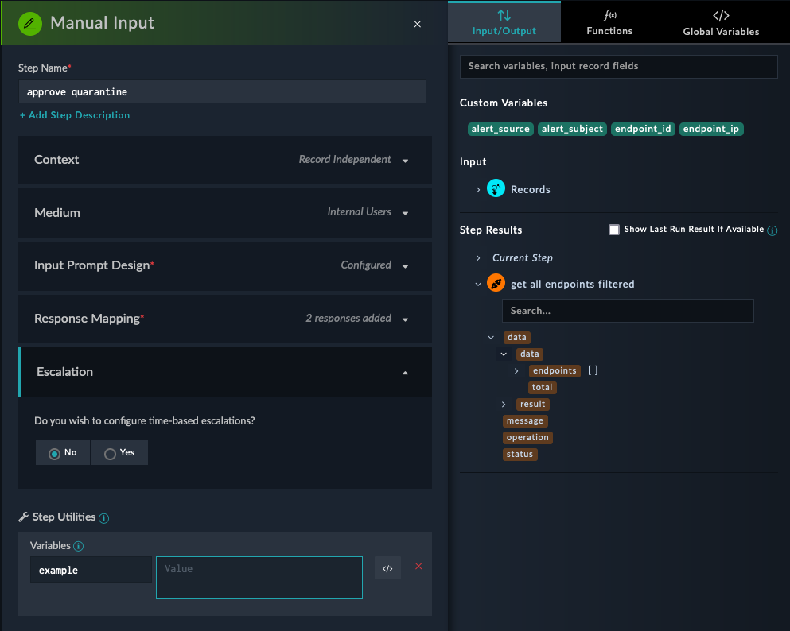

Click on `Save` to save our progress. Also don't forget to save your Playbook.

The Playbook should look similar like the following:

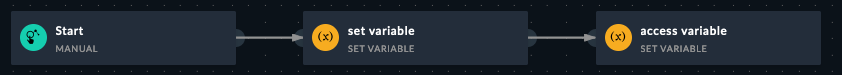

Let's run out created playbook. For this click on the "Play"-Button as described above. As no input is required, click on `Execute` at the bottom left.

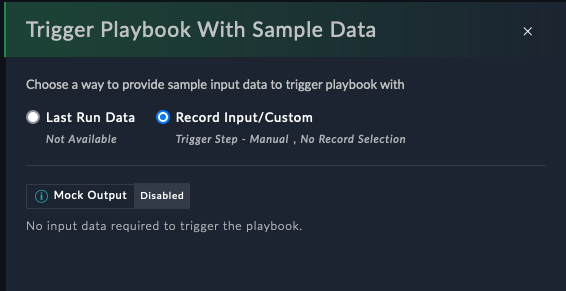

The Execution Log will appear. 

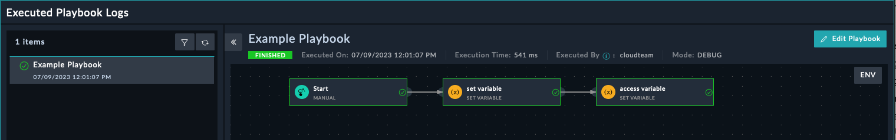

To debug the Playbook Steps, select the `set variable` Step. This allows to have a closer look what was the `Input` &`Output` of the Step.

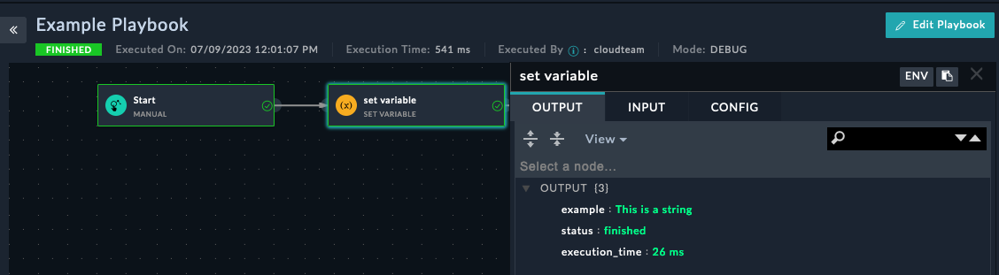

Looking at the second Step, at the Input Tab you will see the Jinja2 Statement on how we accessed the Variable

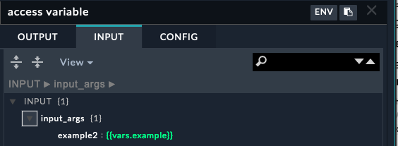

And the Result can be viewed within the Output Tab

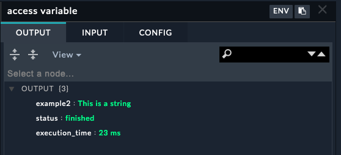

This was a very simple Playbook but for now this is everything you need to know to solve Challenge.

In the next Section, you will find some useful Jinja2 expression examples and Links which can be very handy.

If the Playbook ist done, you can use it e.g. within the Alerts Section. For this, just select an exiting alert and choose the `Execute` Menu entry at the top. The select the corresponding Playbook you want to execute.

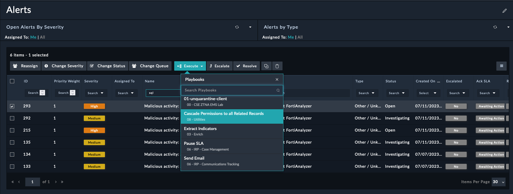