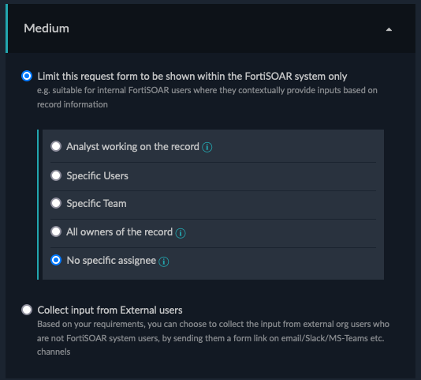

### Challenge 2 Solution
In this Section you will find a detailed solution of the previos tasks. In addition, there are example Playbooks attached which you can import as a solution.

#### Example Playbook Overview

- [Download Example Playbook](../assets/Solution-2-Playbook-(2023711135).json)

### Step Details

1. Stepname: `Start`

This is the Intitial Step. It is configured to start `Manual` and the Scope is defined to be only relevant for `Alerts`

2. Stepname: `extract alert source data`

FortiSOAR attaches by default the complete source data to every alert. This includes also non-visible information. As this Playbook extracts the Client IP address and for a better readablity, the source data will be extracted into it's own variable.

3. Stepname: `extract client details`

Based on the source data of the alert, the client ip address and the alert subject would be relevant for further use. These get stored within their own variables.

4. Stepname: `get all endpoints filtered`

This step will use the FortiClient EMS Connector to retrieve all endpoints but with a filter based on the client ip address based on the information of the alert.

5. Stepname: `approve quarantine`

Before quarantine the client, a approval step based on the `Manual Input` Step is defined. This Step will output various details as requested by the Task and proceeds depending on the Button which is selected by the User.

6. Stepname: `unquarantine client`

This step leverages the FortiClient EMS connector to unquarantine the Client based on the client id which can be extracted of the result of step `get all endpoints filtered`

6. Stepname: `cancel execution`

This step is just an empty step which does nothing but ends the execution of the Playbook.
